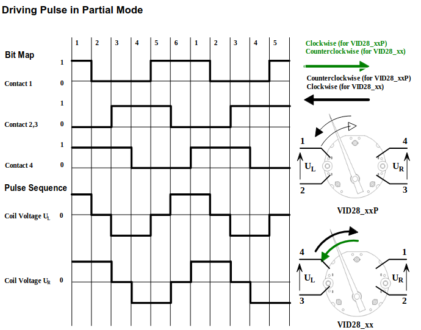

# Clockclock

This personal project first intention is to build a clock with a design inspired
by [Human since 1982](https://www.humanssince1982.com/).

1. [The idea](#the-idea)
2. [The solution](#the-solution)
    1. [Motors](#motors)
    2. [Real Time Clock (RTC)](#real-time-clock-rtc)
    3. [Hands](#hands)
3. [Hardware](#hardware)

## The idea

There are many open source models and all these projects use several microcontrollers, often one for two motors, which
makes the project expensive and adds a lot of complexity.
This makes the project expensive and adds a lot of complexity. My aim is to achieve a much simpler and cheaper project
with a single MCU controlling all 48 motors.
My aim is to achieve a much simpler and cheaper project with a single MCU controlling all 48 motors. This design also
integrates the reading of 48 Hall-effect sensors
with the same MCU.

I also wanted to create a clock that was always on time but not connected to the internet.

The final constraint was to make the clock as small as possible, with a target length of 50cm.

## The solution

### Motors

I chose stepper motors `BKA30D-R5` as they are relatively cheap (<4€/piece), then can turn 360°, and they are 6 cm long
which is small enough for the project. Also, they consume only 20mA per motor so a regular USB-C phone charger can
handle it (20mA x 48 motors = 960mA).

All motors are controlled by an ESP32-C3 (RISC-V architecture). This MCU is connected to a series of 24 bit shift
registers. Those motors are easily controlled with 4 pins, the sequence is described in their datasheet:

One bit shift register has 8 output so it controls 2 motors. At any point of time the MCU knows the motor sequence step.
Periodically, the MCU sends the step sequence through bit shift registers and once all of them have been updated with
the correct sequence, the MCU latch the output. So the MCU is connected to the first bit shift register only and this
requires 3 GPIO: shift_clock, latch_clock and data_out. As all bitshift registers are connected in series, each of them
send the config to the next one.

### Real Time Clock (RTC)

For the clock to be always on time without internet, I integrated a DCF77 module that picks up the time sent by radio
from Germany. Then this time is used to configure the RTC in the DS3231 module.

### Hands

Hands are calibrating with hall effect sensors that detect a small magnet fixed on the hands. To minimize the GPIO
input, this hall sensor output is digital, the output will be either 1 or 0, there is no analog circuit. The output of
all hall sensors are connected together and protected by a diode. This output goes into the MCU as input.

The sensors will be switched on one at a time; no two sensors will ever be switched on at the same time to avoid
conflict with the output.
The power supply of the sensor is also driven by the bitshift register. As motors can be driven with 3 wires instead of
4 (contacts 2 and 3 toggle together according to the datasheet), then there are 2 slots available out of the 8 of
the bitshift register. Those 2 ports are used to switch on/off the two hall effect sensors on every motor board.

## Hardware

The hardware consists of 2 parts:

- a main PCB containing:
    - 1
      x [ESP32-C3 devkit-m1](https://docs.espressif.com/projects/esp-dev-kits/en/latest/esp32c3/esp32-c3-devkitm-1/index.html)
    - 24 x [Power Logic 8-Bit Shift Register](https://www.ti.com/lit/ds/symlink/tpic6c595.pdf)
    - filtering capacitor for the motors
    - 1 x DS3231 RTC & EEPROM
    - 1
      x [CANADUINO DCF77 Radio Clock Receiver Module](https://universal-solder.ca/docs/CANADUINO_Atomic_Clock_Receiver_Kit_V2.pdf)
- 24 PCB connected to motors:
    - stepper motor BKA30D-R5
    - hall
      sensor [HAL1503](https://product.tdk.com/system/files/dam/doc/product/sensor/switch/hall-switch/data_sheet/hal_15xy_hall-effect_switches_with_open-drain_output_3-wire_in_to92_package.pdf)

Power supply is provided by a USB-PD
module [COM-ZY12PDN-ST](https://www.joy-it.net/files/files/Produkte/COM-ZY12PDN-ST/COM-ZYPDN-ST_Datasheet_2021-11-10.pdf)
so it be powered on easily.

Here are the schematic of [the driver board](elec/driver_board/output/driver_board.pdf)
and [the motor board](elec/motor_board/output/motor_board.pdf).
