# ClockClock - 48 Stepper Motors Kinetic Clock

Personal project of a kinetic clock inspired by [Humans Since 1982](https://www.humanssince1982.com/), using 48 stepper
motors to display time in an artistic and dynamic way.


## Table of Contents

- [Project Overview](#project-overview)
- [Technical Architecture](#technical-architecture)
- [Hardware](#hardware)
- [Firmware](#firmware)
- [Build and Flash](#build-and-flash)
- [Configuration](#configuration)
- [Schematics and Documentation](#schematics-and-documentation)

---

## Project Overview

### Goals

This project aims to create a kinetic clock with the following constraints:

1. **Simplicity**: Use a single microcontroller (ESP32-C3) to control all 48 motors, unlike similar projects that use
   multiple MCUs
2. **Time Accuracy**: Always accurate clock without permanent internet connection thanks to DCF77 receiver
3. **Compact Size**: Target dimensions around 100 cm length
4. **Cost-Effective**: Reasonable budget using BKA30D-R5 motors at ~4€/piece

### Specifications

- **48 stepper motors** individually controlled
- **Display**: 4 digits (HH:MM) with 12 motors per digit
- **Angular Resolution**: 4320 steps/revolution (12 steps/degree)
- **Power Consumption**: ~960 mA @ 5V (20mA/motor)
- **Time Synchronization**: DCF77 (European long-range radio signal)

---

## Technical Architecture

### Overview

The ClockClock architecture is built around a highly efficient, centralized control system that manages all 48 stepper
motors from a single ESP32-C3 microcontroller. This approach contrasts with typical multi-motor projects that require
multiple microcontrollers or complex distributed systems.

#### Control Chain

```
ESP32-C3 → TPIC6C595 Shift Registers (×12) → VID6606 Motor Drivers (×12) → BKA30D-R5 Motors (×48)
   ↓                    ↓                              ↓                           ↓
 3 GPIO              96 bits                    2 signals per motor         2 bits per motor
  pins            (SPI @ 10MHz)                  (STEP + DIR)              (individual control)
```

#### Key Design Principles

1. **Minimal GPIO Usage**: The entire system uses only 3 GPIO pins (MOSI, SCK, SS) thanks to the shift register cascade.
   This leaves the ESP32-C3's remaining pins available for other peripherals (I2C for RTC, buttons, encoder, etc.).

2. **Serial-to-Parallel Conversion**: The 12 cascaded TPIC6C595 shift registers convert the serial SPI data stream into
   96 parallel outputs. Each motor requires 2 control bits (STEP and DIR), allowing precise control of all 48 motors
   simultaneously.

3. **Hierarchical Organization**:
    - **1 ESP32-C3**: Single point of control and decision-making
    - **12 Shift Registers**: Each controlling 4 motors (8 bits per register)
    - **12 VID6606 Drivers**: Each driving 4 motors independently
    - **48 Motors**: Organized in 4 groups of 12 (one per digit displayed)

4. **Data Flow Pipeline**:
   ```
   Time/Animation Logic → Motor Position Calculation → SPI Data Preparation → 
   Hardware SPI Transfer (10µs) → Parallel Latch → Simultaneous Motor Update
   ```

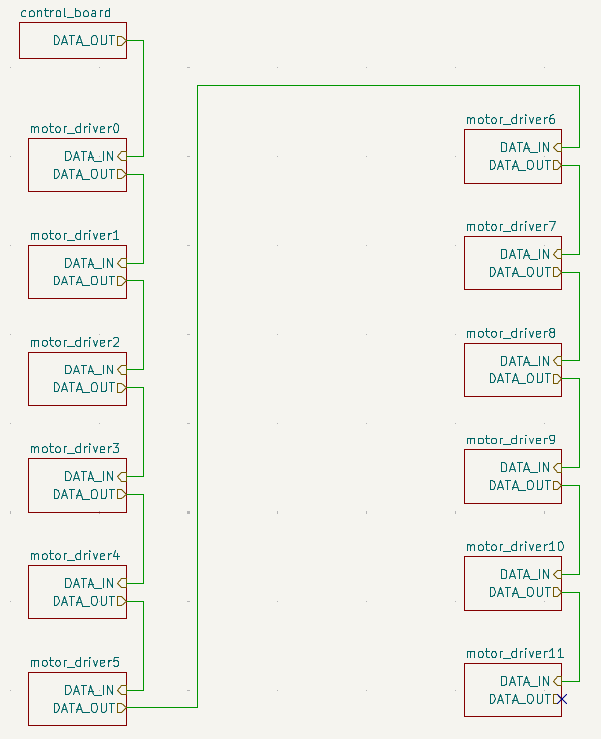
*All motor blocks are linked together*

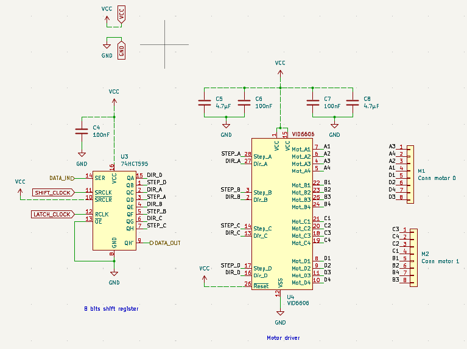
*A motor block*

### Motor Control

#### BKA30D-R5 Stepper Motors

Features:

- **Type**: Bipolar stepper motor
- **Current**: 20 mA per motor
- **Resolution**: 360° continuous rotation
- **Torque**: Suitable for lightweight hands (acrylic)

<p>
  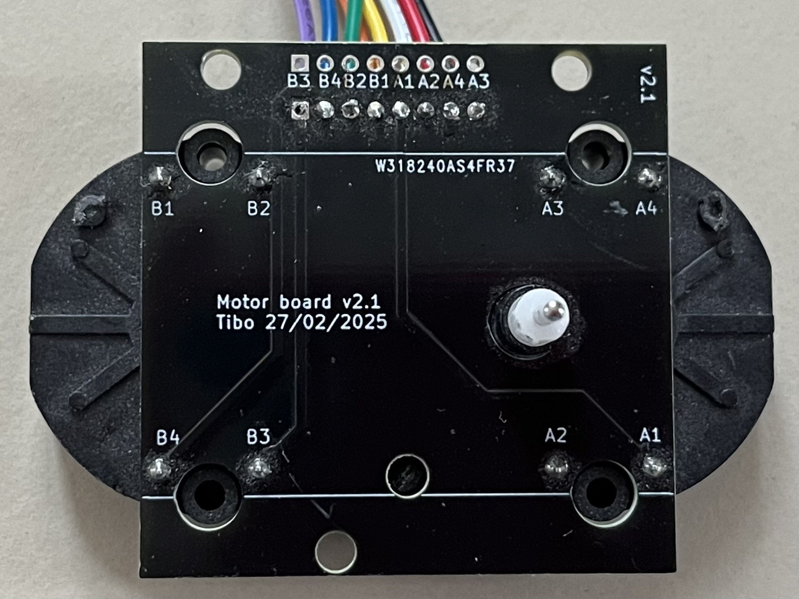
  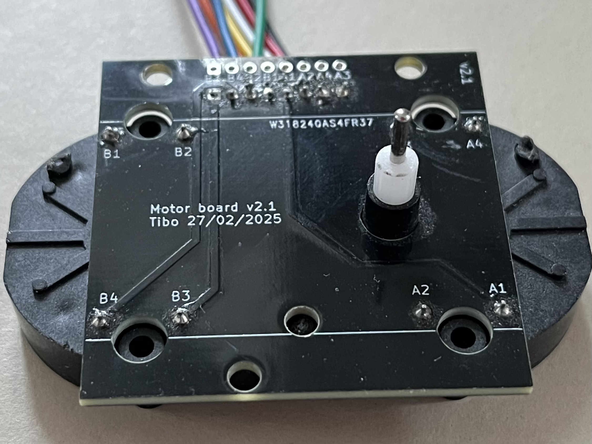

<em>The motor itself with its PCB to connect to the motor driver</em>
</p>

#### VID6606 Drivers

Each VID6606 driver (or equivalent AX1201728SG/STI6606z) can control **4 motors** with only 2 signals per motor:

- **STEP**: Step signal (rising edge = one step)
- **DIR**: Direction (HIGH/LOW)

<p>
  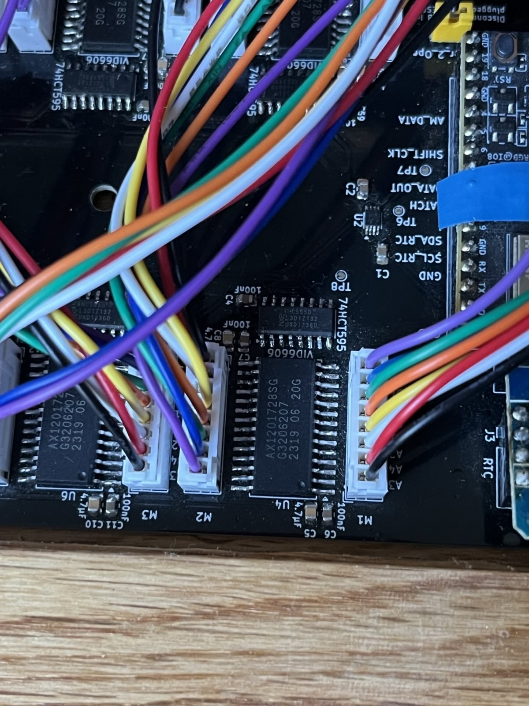

<em>The AX1201728SG driver is connected to 4 motors (the two connectors on its right and left). On top, the shift
register</em>
</p>

#### TPIC6C595 Shift Registers

- **Quantity**: 12 x 8-bit registers in cascade
- **Total**: 96 bits of control for 48 motors (2 bits/motor)
- **Communication**: Hardware SPI interface from ESP32-C3
- **Clock Speed**: 10 MHz
- **Data Transfer**: 12 bytes (96 bits) in approximately 10 µs
- **Signals**:
    - **MOSI** (Data Out): Serial data to first register
    - **SCK** (Shift Clock): Shift clock at 10 MHz
    - **SS** (Latch Clock): Synchronous output latch

**Key Advantages**:

1. **Hardware SPI Optimization**: Using the ESP32-C3's hardware SPI peripheral instead of bit-banging provides
   significant performance improvement. The 10 MHz clock allows extremely fast data transfer of all 12 bytes in
   approximately 10 microseconds.
2. **Perfect Synchronization**: The latch mechanism ensures all 48 motors receive their new commands simultaneously in a
   single atomic operation. There is no timing skew between motors - they all update at exactly the same moment when the
   latch signal is triggered.
3. **Monolithic Control**: This architecture provides a single point of control with zero concurrency issues. All motor
   states are managed centrally by the ESP32-C3, eliminating the complexity and synchronization challenges found in
   distributed control systems using multiple microcontrollers.
4. **Deterministic Timing**: The fast SPI transfer combined with the synchronous latch ensures predictable, jitter-free
   motor updates, critical for smooth visual animations.

### Time Synchronization

#### DS3231 RTC Module

- **Accuracy**: ±2 ppm (±1 minute/year)
- **Interface**: I2C
- **Battery**: CR2032 backup for timekeeping

#### DCF77 Receiver

- **Module**: CANADUINO DCF77 Radio Clock Receiver Kit V2
- **Frequency**: 77.5 kHz (transmitter in Mainflingen, Germany)
- **Range**: ~2000 km in optimal conditions
- **Accuracy**: Atomic clock synchronization
- **Function**: Automatic DS3231 recalibration

#### DST (Daylight Saving Time) Management

The firmware implements European rules:

- **Summer Time Start**: Last Sunday of March at 2:00 → 3:00 (UTC+2)
- **Winter Time Start**: Last Sunday of October at 3:00 → 2:00 (UTC+1)
- **Automatic Calculation**: Zeller's algorithm to determine Sundays

---

## Hardware

### Main Board

**Files**: `elec/clockclock_main/` → [PDF Schematic](elec/clockclock_main/output/clockclock_main.pdf)

<p>
  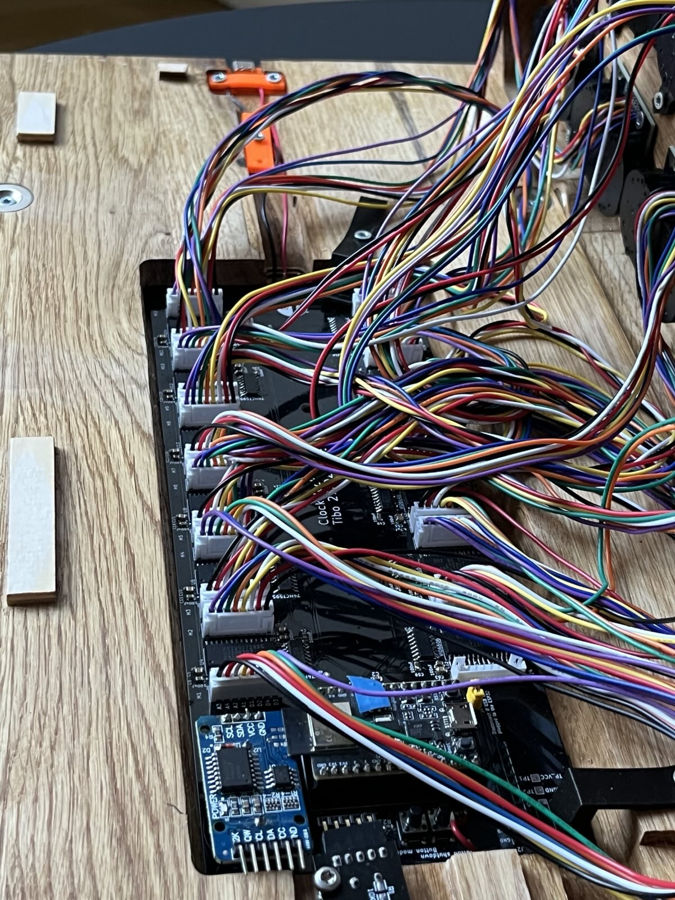
  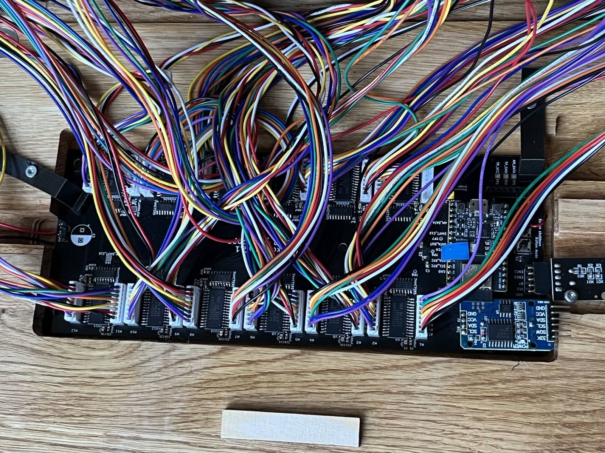

<em>Main board fully wired</em>
</p>

<p>
  

<em>Clock starts</em>
</p>

#### Main Components

| Component       | Reference             | Quantity | Function                 |
|-----------------|-----------------------|----------|--------------------------|
| Microcontroller | ESP32-C3-DevKitM-1    | 1        | Central control (RISC-V) |
| Shift Registers | TPIC6C595             | 12       | Output expansion         |
| Motor Drivers   | VID6606 / AX1201728SG | 12       | 4 motors per driver      |
| RTC             | DS3231                | 1        | Real-time clock          |
| Radio Receiver  | DCF77 CANADUINO       | 1        | Atomic sync              |

#### User Interface

**Buttons**:

- **PIN 0**: Rotary encoder button
- **PIN 1**: Mode (short = config, long = calibration)
- **PIN 10**: Shutdown (long press)

**Rotary Encoder**:

- **PIN 2**: Encoder A (interrupt)
- **PIN 3**: Encoder B (interrupt)

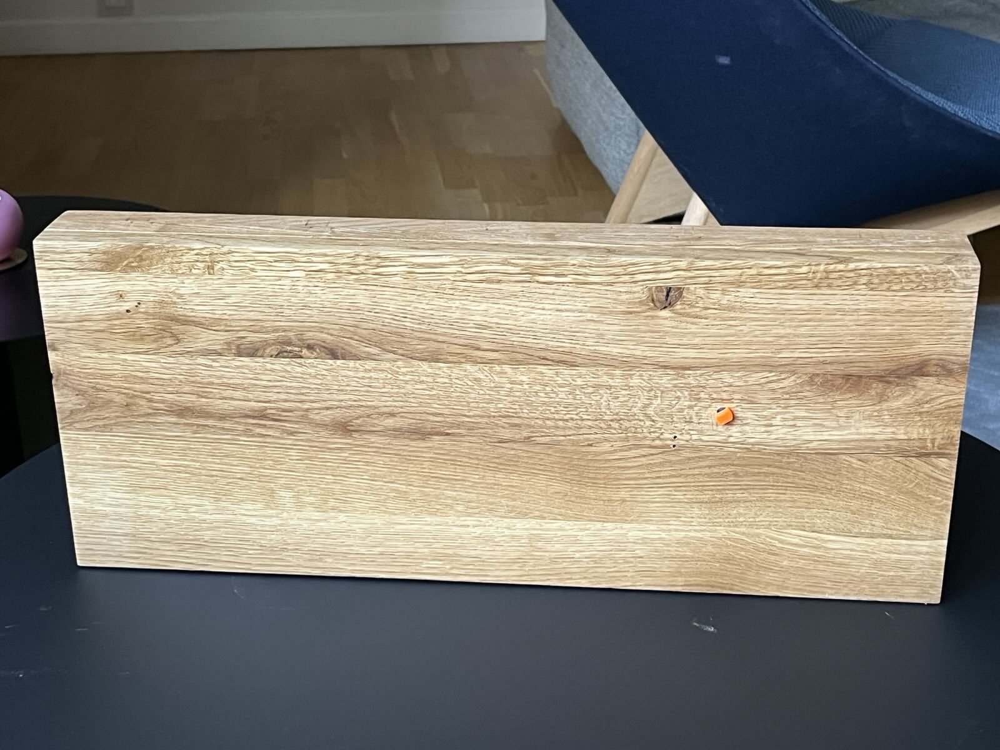
*Only one button is connected (the orange button here), and it is used to enter the "shutdown" mode*

### Motor Boards

**Files**: `elec/clokclock_stepper/` → [PDF Schematic](elec/clokclock_stepper/output/clokclock_stepper.pdf)

Each board is very simple and connects a BKA30D-R5 motor to its VID6606 driver.

**Total**: 24 identical motor boards

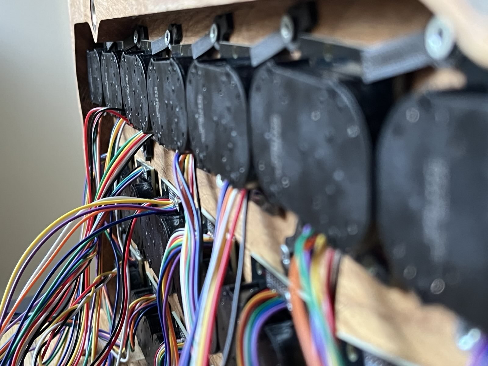
*Row of motors mounted on the main frame*

### Power Supply

- **Source**: Standard USB-C charger
- **Voltage**: 5V DC
- **Current**: Minimum 1.5A recommended
- **Regulation**: Integrated on ESP32-C3-DevKitM-1 (3.3V logic)

### Hands

This is the part that took most of the design time!
I tried many different materials and manufacturing methods before settling on laser-cut acrylic hands.

The challenge is to be able to manufacture hands that can be unmounted/remounted easily and that fit perfectly on the
motor shaft.  
In addition, the hands should be as close together as possible in order to maintain a good viewing angle when looking at
the clock from the side.

<p>
  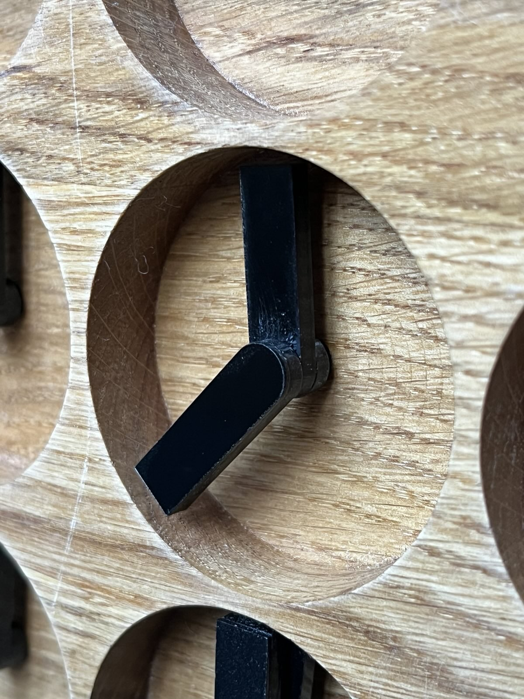
  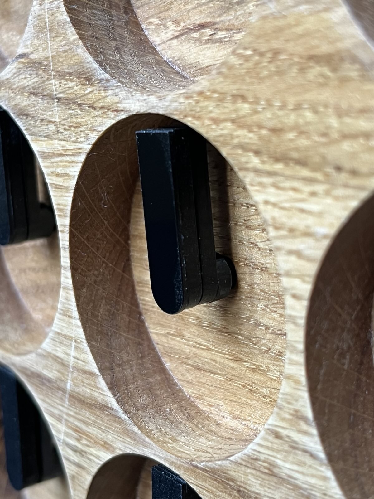

<em>Mounted hands</em>
</p>

Here is the final solution I adopted:

*Hands assembly*

Both the top and bottom hands are in two acrylic parts glued together.  
The top one as a 1mm acrylic part glued to a 3mm part that fits on the motor shaft.  
The bottom one is a 3mm part glued to a 3mm part that fits on the motor shaft.

---

## Firmware

### Development Environment

- **Framework**: Arduino (PlatformIO)
- **Platform**: Espressif32
- **Language**: C++20 (GNU++2a)
- **IDE**: VSCode + PlatformIO recommended

### Code Structure

```
firmware/
├── platformio.ini          # Project configuration
├── include/
│   └── cfg.hpp            # Global constants (motors count, pins, etc.)
└── src/
    ├── main.cpp           # Entry point
    ├── time_manager.*     # Time management and DST
    ├── ntp_sync.*         # Optional NTP sync (dev only)
    ├── animation/         # Animation system
    │   ├── animation_manager.*
    │   ├── wave_animation.*
    │   └── sync_rotation_animation.*
    ├── button/            # Button and encoder handling
    │   └── button.*
    ├── mode/              # Operating modes
    │   ├── mode.*
    │   ├── calibration.*
    │   └── cfg_time.*
    └── motor/             # Motor control
        ├── motor_motion.* # Mapping and sequences
        ├── motion.*       # Display logic
        ├── shift_register.* # SPI interface
        └── AccelStepper.* # Movement library
```

### Operating Modes

The firmware implements several operation modes:

#### 1. MODE_CLOCK_DISPLAY (default)

- Display current time
- Update every minute
- Execute scheduled animations
- Sync with RTC every 500ms

#### 2. MODE_CLOCK_CONFIG

- Manual time configuration
- Navigation with rotary encoder
- Button validation
- 20s timeout → return to display

#### 3. MODE_CALIB (calibration)

- Access: long press MODE button
- Function: Reset zero position of all motors
- Sequence: rotation to reference position, manual validation, save new origin

#### 4. MODE_SHUTDOWN

- Access: long press SHUTDOWN button
- All motors return to neutral position (0°)
- Power saving mode

### Animation System

The `AnimationManager` enables choreographed animations:

**Available Animations**:

1. **Wave Animation**: Undulating wave across all motors
2. **Sync Rotation**: Synchronized rotation of all motors
3. **Custom**: Possibility to implement new animations

**Triggering**:

- **Scheduled**: At specific times (e.g., every hour)
- **Manual**: Via user interface
- **Transition**: Between digit changes

### Libraries

PlatformIO dependencies:

- `NorthernWidget/DS3231@1.1.2`: RTC interface
- `arduino-libraries/NTPClient@^3.2.1`: Optional NTP sync

---

## Build and Flash

### Prerequisites

```bash
# Install PlatformIO CLI
pip install platformio

# Or via VSCode: Install "PlatformIO IDE" extension
```

### Build

```bash
cd firmware/
pio run
```

### Upload to ESP32-C3

```bash
# Via USB
pio run --target upload

# Serial monitor
pio device monitor
```

### WiFi Configuration (Optional)

To enable NTP sync during development, enable `NTP_WIFI_SYNC` define in `main.cpp` and configure your WiFi credentials.

Note: In production, WiFi is not required thanks to the DCF77 module.

---

## Configuration

### Motor Parameters

Motor speed and acceleration can be adjusted in `firmware/src/motor/motor_motion.cpp`.

### Timezone Configuration

The firmware is configured for Central European Time (CET/CEST) by default. To change timezone, modify the DST
configuration in `main.cpp`.

### Initial Calibration

1. Power on the device
2. **Long press** MODE button → Calibration mode
3. Verify physical alignment of hands
4. Validate with encoder button
5. System saves new zero reference

---

## Schematics and Documentation

### Electronic Design Files

| Document              | Path                                                                                                         | Format |
|-----------------------|--------------------------------------------------------------------------------------------------------------|--------|
| Main board schematic  | [`elec/clockclock_main/output/clockclock_main.pdf`](elec/clockclock_main/output/clockclock_main.pdf)         | PDF    |
| Main board PCB        | `elec/clockclock_main/clockclock_main.kicad_pcb`                                                             | KiCad  |
| Motor board schematic | [`elec/clokclock_stepper/output/clokclock_stepper.pdf`](elec/clokclock_stepper/output/clokclock_stepper.pdf) | PDF    |
| Motor board PCB       | `elec/clokclock_stepper/clokclock_stepper.kicad_pcb`                                                         | KiCad  |
| Driver test board     | `elec/test_board_motor_driver/`                                                                              | KiCad  |

### Datasheets

All datasheets are available in the [`datasheet/`](datasheet/) folder:

- **Motor**: [BKA30D-R5.webp](datasheet/BKA30D-R5.webp)
- **Driver**: [VID28 user manual](datasheet/VID28%20user%20manual-1.pdf)
- **DCF77**: [CANADUINO_Atomic_Clock_Receiver_Kit_V2.pdf](datasheet/CANADUINO_Atomic_Clock_Receiver_Kit_V2.pdf)

---

## Development Notes

### Debug

The code includes conditional debug flags that can be enabled in respective source files:

- `DEBUG` - General messages
- `DEBUG_MOTION` - Motor control debug
- `DEBUG_TIME_MGMT` - Time management debug
- `DEBUG_ANIMATION` - Animation debug
- `DEBUG_MODE` - Mode debug

### Pre-commit Hooks

Git pre-commit configuration available: `.pre-commit-config.yaml`

```bash
pip install -r requirements.txt
pre-commit install
```

---

## License

This project is open-source. Free to use and modify.

## Acknowledgments

Inspired by the artistic work of [Humans Since 1982](https://www.humanssince1982.com/).
